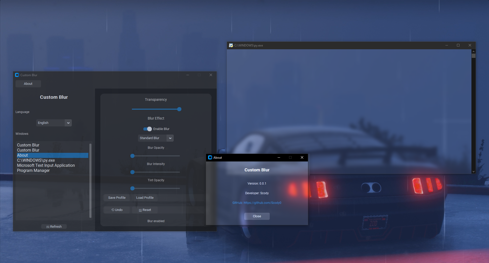
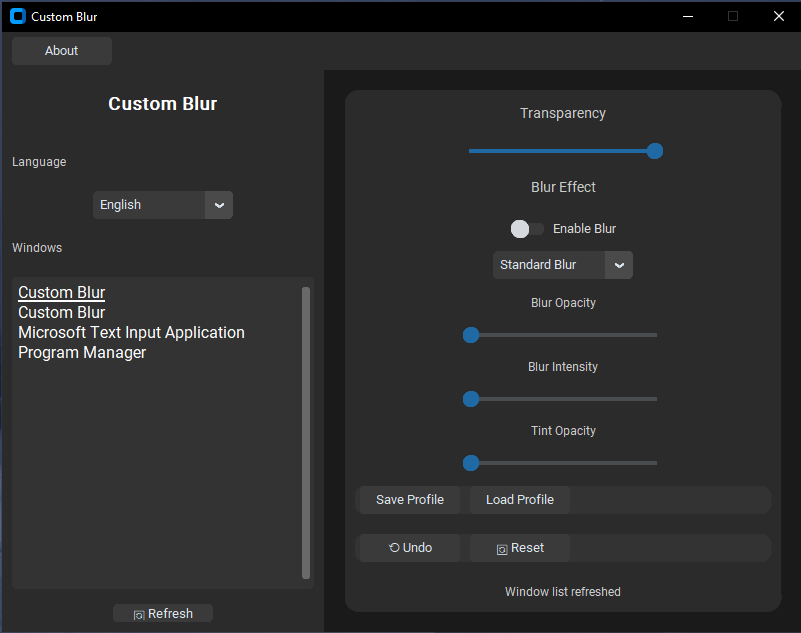
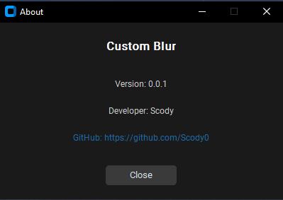

<h1 align="center">⭐ Custom Blur ⭐</h1>
<p align="center">

 <!-- Replace with actual logo or screenshot -->

**Custom Blur** is a lightweight Windows application that allows users to apply stunning blur and transparency effects to any window. With an intuitive interface, multilingual support, and customizable profiles, it offers a unique way to enhance your desktop experience.


---

## Screenshots

| Main Interface | About Dialog |
|----------------|--------------|
|  |  |

---

## Installation

### Prerequisites
- **Operating System**: Windows 10 or 11 (with Desktop Window Manager enabled)
- **Python**: Version 3.6 or higher
- **Dependencies**: `customtkinter`, `pygetwindow`

### Steps
1. **Clone the Repository**:
   ```bash
   git clone https://github.com/Scody0/Custom-Blur.git
   cd Custom-Blur
   ```

2. **Install Dependencies**:
   ```bash
   pip install customtkinter pygetwindow
   ```

3. **Run the Application**:
   ```bash
   python custom_blur.py
   ```

Alternatively, install dependencies from `requirements.txt`:
```bash
pip install -r requirements.txt
```

---

## Usage
| Transparency | Blur Effect |
|----------------|--------------|
|  |  |

1. **Launch the Application**:
   Run `custom_blur.py` to open the Custom Blur interface.

2. **Select a Window**:
   - Use the sidebar to view a list of active windows.
   - Click a window title to select it for customization.
   - Enable **Auto-Refresh** to keep the list updated.

3. **Apply Effects**:
   - **Transparency**: Adjust the slider (50–255) to set window opacity.
   - **Blur Effect**: Toggle blur on/off and choose between **Standard Blur** or **Acrylic Blur**.
   - **Blur Settings**: Fine-tune blur opacity, intensity, and tint opacity using sliders.
   - Use **Undo** to revert the last change or **Reset** to restore the window’s original state.

4. **Manage Profiles**:
   - **Save Profile**: Save your current settings for a window.
   - **Load Profile**: Apply a saved profile to a matching window.

5. **Change Language**:
   - Select your preferred language from the sidebar dropdown (e.g., English, Українська, Русский).

6. **View About**:
   - Click the **About** button in the top bar to see program details, including version and developer info.

---


## About

- **Version**: 0.0.1
- **Developer**: Scody
- **GitHub**: [Scody](https://github.com/Scody0)
- **License**: MIT

Custom Blur is an open-source project designed to bring aesthetic window effects to Windows users. Contributions and feedback are welcome!

---

## Troubleshooting

- **Blur Effects Not Working**:
  - Ensure Desktop Window Manager (DWM) is enabled (Windows 10/11).
  - Check if the selected window supports blur effects (some system windows may not).

- **Language Not Updating**:
  - Verify that `blur_config.json` is writable in the application directory.
  - Delete `blur_config.json` to reset to English.

- **Errors**:
  - Enable logging by uncommenting the logging setup in `custom_blur.py`.
  - Check `custom_blur.log` for detailed error messages.

For further assistance, open an issue on GitHub.

---

## License

This project is licensed under the MIT License. See the [LICENSE](LICENSE) file for details.

---

## Contact

- **Developer**: Scody
- **GitHub**: [https://github.com/Scody0](https://github.com/Scody0)
- **Issues**: [https://github.com/Scody0/Custom-Blur/issues](https://github.com/Scody0/Custom-Blur/issues)

Feel free to reach out with questions, suggestions, or feedback!

---

*Built with ❤️ by Scody*
